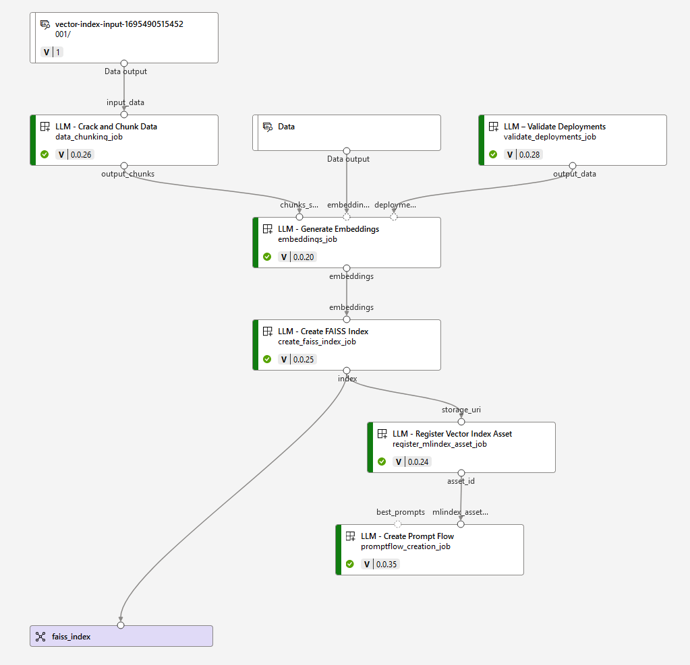
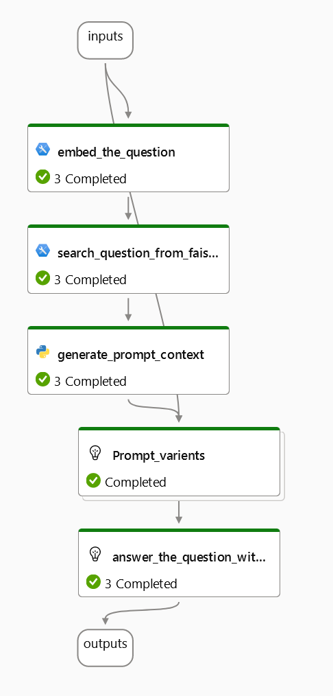

# GPT on Genomes

<h3 align="right">Colby T. Ford, Ph.D.</h3>

Use Azure OpenAI and Azure Machine Learning Studio to create a GPT model with a genomics context. This example allows for ChatGPT-like chat interactivity with variant information (from a modified VCF data).

Companion Repo for: https://medium.com/@colbyford/11fc607f1b3

## FAISS Index - Job Outline

## Prompt Flow

YAML File: [prompt_flow.yml](prompt_flow.yml)

### Example VCF Prompt Variants: [prompts.md](prompts.md)
